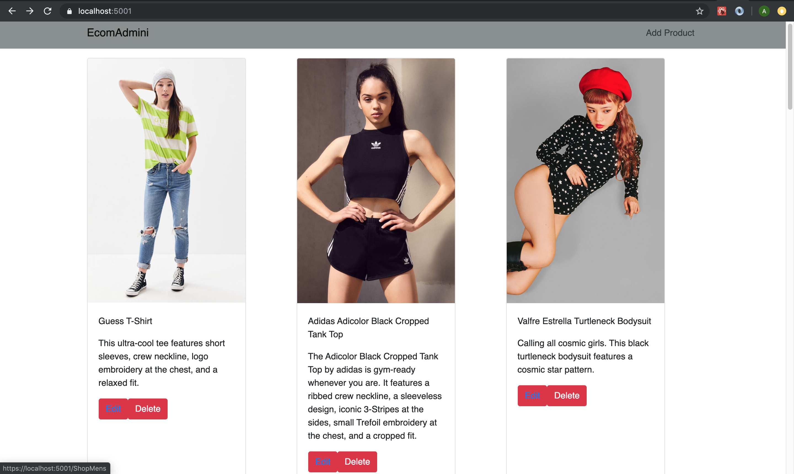

# EcomCsharp

EcomCSharp Admin 

Project 4 CSharp Ecommerce Admin Project consists of the following requirements: 

- Must include screen shots (or gifs)of your working ReactJS web pages in the README of your GitHub
- No auth or cloud deployment is required
- Must meet good-quality coding standards (indentation, scoping, naming, etc.)
- Must deploy your repo to GitHub (professionally composed)
- Must demonstrate all CRUD methodsMust be connected with your ReactJS app
- Must use a dotnet web serverMust be backed by a MySQL database seeded with your data from Project 3
is required

